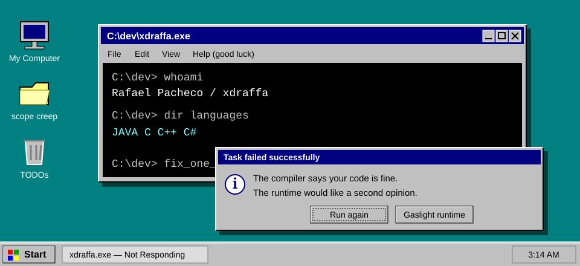

<p align="center">
  
</p>

<h1 align="center">welcome to rafael's personal homepage</h1>
<p align="center"><strong>BEST VIEWED AT 800 × 600 · OPTIMIZED FOR ABSOLUTELY NOTHING</strong></p>

<p align="center">
  <a href="https://www.icegif.com/minions-360/"></a>
  &nbsp; &nbsp; <strong>you are visitor number: probably</strong> &nbsp; &nbsp;
  <a href="https://www.icegif.com/minions-360/"></a>
</p>

# C:\dev\rafael

I'm **Rafael**, aka **xdraffa**. I write **Java, C, C++, and C#**. My computer writes fan noise.

I like figuring out what the machine is actually doing. The machine would prefer I didn't.

```text
C:\dev> build
0 errors. suspicious.

C:\dev> run
the plot thickens.
```

<p align="center">
  <a href="https://tenor.com/view/fire-divider-gif-19050659"></a>
</p>

## Add/Remove Programs

| Installed | Incident report                                           |
| --------- | --------------------------------------------------------- |
| **Java**  | Built a `HelloWorldFactoryFactory`. It prints goodbye.    |
| **C**     | Freed the memory. It has moved on. I haven't.             |
| **C++**   | Enabled warnings. Now the compiler and I aren't speaking. |
| **C#**    | Added `!`. The compiler forgave me. The runtime didn't.   |

## System Properties

```ini
[user]
name = Rafael Pacheco
alias = xdraffa
languages = Java, C, C++, C#

[hardware]
 cooling = dancing cats
 heating = compiler
 stability = please do not move the mouse
```

<details>
<summary>⚠️ This program has performed an illegal operation.</summary>

I changed a variable name and the bug disappeared.

I changed it back and the bug stayed gone.

I have chosen not to investigate this gift.

**[ Close ] [ Debug ] [ Accept the miracle ]**

</details>

<p align="center">
  <a href="https://www.icegif.com/dancing-cat-24/"></a><br />
  <sub>this cat has no idea what a compiler is. look how happy it is.</sub>
</p>

---

**[ Start ]** &nbsp; [My Computer → Repositories](https://github.com/xdraffa?tab=repositories) &nbsp; | &nbsp; [Internet Explorer → LinkedIn](https://www.linkedin.com/in/rafael-pacheco-dev/)

<sub>It is now safe to turn off your computer. Unsaved changes are a problem for tomorrow's you.</sub>
